# Installation guide, with pictures

This guide takes about five minutes. No technical knowledge is needed.

The Household Wealth Dashboard runs on **Windows, Mac, Android, iPhone and
iPad**. Everything stays on your own device. There is no account to create, no
password, and no fee.

### The link

**https://householdfinancemanager.netlify.app/**

Open that on any device to begin. Everything below explains what to do next.

---

## Contents

1. [Start here: pick your device](#1-start-here-pick-your-device)
2. [Install on Windows or Mac](#2-install-on-windows-or-mac)
3. [Install on iPhone or iPad](#3-install-on-iphone-or-ipad)
4. [Install on Android](#4-install-on-android)
5. [Set up your household](#5-set-up-your-household)
6. [Add your spending](#6-add-your-spending)
7. [Back up your data](#7-back-up-your-data)
8. [Have a look around](#8-have-a-look-around)
9. [If something goes wrong](#9-if-something-goes-wrong)
10. [Common questions](#10-common-questions)

---

## 1. Start here: pick your device

Find your device below.

| You are on | Go to |
|---|---|
| iPhone or iPad | [Section 3](#3-install-on-iphone-or-ipad) |
| Android phone or tablet | [Section 4](#4-install-on-android) |
| Windows or Mac | [Section 2](#2-install-on-windows-or-mac) |

Everyone uses the same link: **https://householdfinancemanager.netlify.app/**

> **On a phone, use the link, not a downloaded file.** Phones have no good way
> to open a saved HTML file. On a computer either works.

---

## 2. Install on Windows or Mac

### The quick way: open the link

**Step 1.** Go to **https://householdfinancemanager.netlify.app/**

**Step 2.** The dashboard opens and is already running. That is all.

Skip to [Section 5](#5-set-up-your-household) to start using it, or read on to
give it its own icon.

### The offline way: one file, no internet at all

If you would rather have the whole thing as a single file on your computer:

**Step 1.** Download
[`dist/wealth-dashboard.html`](https://github.com/Hassanolowofela/wealth-dashboard/raw/main/dist/wealth-dashboard.html)

**Step 2.** Double-click it. It opens in your browser and works with no internet
and nothing installed.

> **Cannot see the `.html` part of the name?** That is normal. Windows hides file
> endings. Look for the file called **wealth-dashboard** with a browser icon.

### If it opens in the wrong program

If double-clicking shows a page full of code instead of the dashboard:

1. Right-click the file
2. Choose **Open with**
3. Choose **Google Chrome** or **Microsoft Edge**
4. Tick **Always use this app**, so it remembers next time

### Optional: give it a proper icon and its own window

This step is not required. Skip it unless you want the dashboard in your Start
menu like a normal program.

Browsers only allow this when the app is opened from a web address rather than a
file, so it takes one extra step.

**Step 1.** Put the app folder somewhere convenient, then open that folder.

**Step 2.** Click once in the address bar at the top of the folder window, type
`cmd`, and press Enter. A black window opens.

**Step 3.** Type this and press Enter:

```bash
python -m http.server 8777
```

> If it says Python is not recognised, install it free from
> [python.org/downloads](https://python.org/downloads) and tick
> **Add Python to PATH** during setup. Then try again.

**Step 4.** Open Chrome or Edge and go to `http://localhost:8777`

**Step 5.** Click your household name at the top left to open the household menu,
choose **Settings**, and click **Install as an app**. You can also use the small install icon at the right-hand
end of the browser address bar.

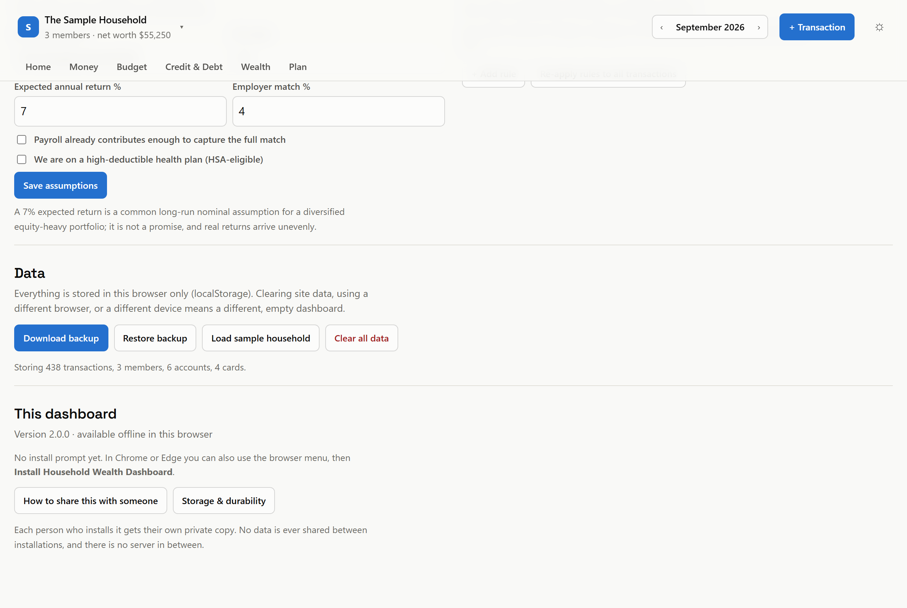

**Step 6.** The dashboard is now in your Start menu. You can close the black
window. It works offline from now on.

Now go to [Section 5](#5-set-up-your-household).

---

## 3. Install on iPhone or iPad

You must use **Safari** for this. Chrome on iPhone cannot add apps to the home
screen.

**Step 1.** Open **https://householdfinancemanager.netlify.app/** in Safari.

**Step 2.** The dashboard appears and is already working.

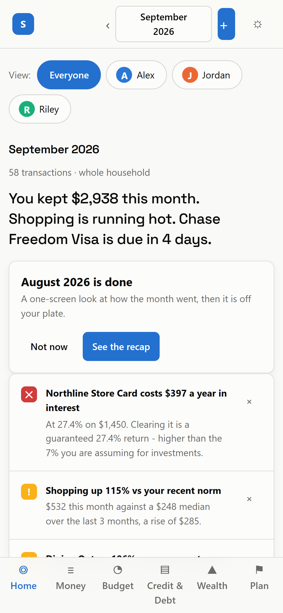

**Step 3.** Add it to your home screen so it behaves like a normal app:

1. Tap the **Share** button, the square with an arrow pointing up
2. Scroll down the list of options
3. Tap **Add to Home Screen**
4. Tap **Add** in the top corner

**Step 4.** Close Safari and open the app from your new home screen icon. It now
has its own window and works without internet.

The dashboard shows you these same steps under **Settings**, which is in the menu
behind your household name at the top left:

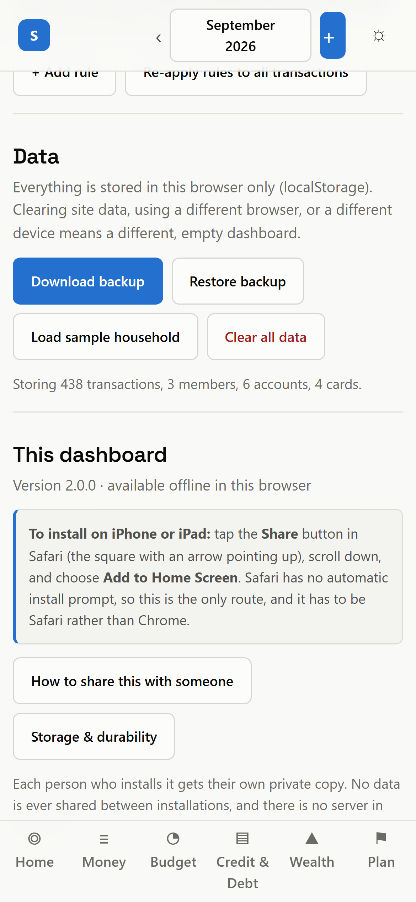

> ### Please read this if you use an iPhone or iPad
>
> Apple's browser clears saved website data for apps you have not opened in a
> while. Adding the app to your home screen and opening it now and then makes
> this unlikely, but it can still happen.
>
> **Back up once a month.** [Section 7](#7-back-up-your-data) shows how. It takes
> five seconds and it is the only protection there is.

Now go to [Section 5](#5-set-up-your-household).

---

## 4. Install on Android

Use **Chrome**, **Edge** or **Samsung Internet**.

**Step 1.** Open **https://householdfinancemanager.netlify.app/** in Chrome.

**Step 2.** The dashboard appears and is already working.

**Step 3.** Add it to your home screen:

- A banner may appear at the bottom offering to install it. Tap that, and you
  are finished.
- If no banner appears, tap the **three dots** menu in the top corner, then tap
  **Install app** or **Add to Home screen**.
- You can also tap your household name at the top left, choose **Settings**, and tap
  **Install as an app**.

**Step 4.** Open it from your home screen icon. It now has its own window and
works without internet.

Now go to [Section 5](#5-set-up-your-household).

---

## 5. Set up your household

The first time you open the dashboard, a welcome screen appears. It asks three
short questions and takes about a minute.

### Step 1 of 3: who lives here

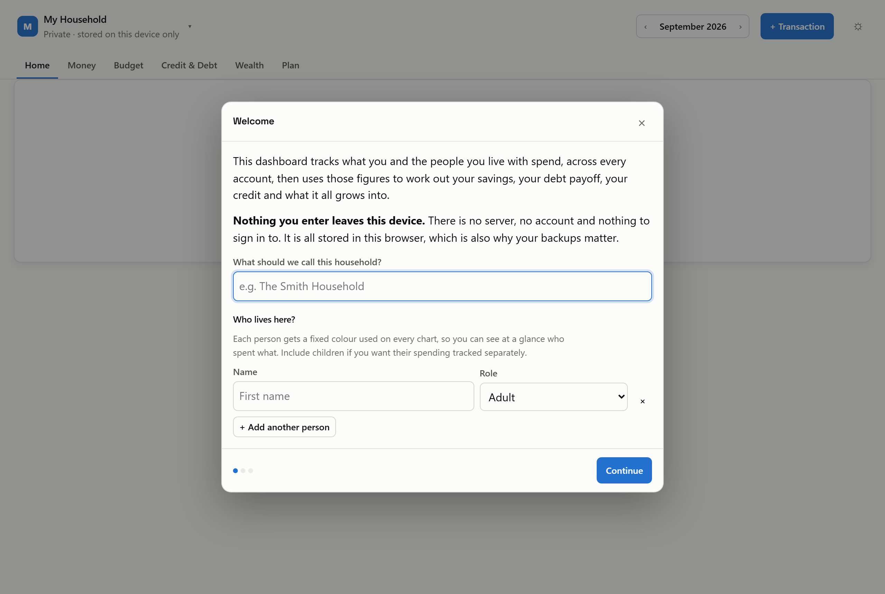

Type a name for your household, for example "The Smith Household".

Then add each person. Type their first name and pick their role from the list.
Tap or click **+ Add another person** for each extra family member.

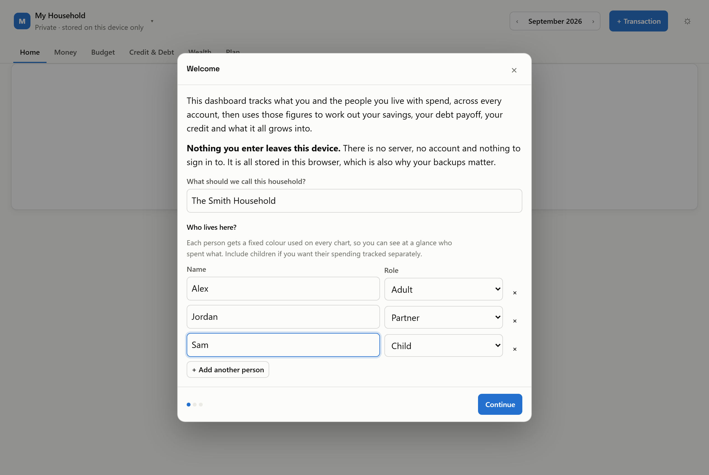

> Every person gets their own colour, and that colour is used on every chart in
> the app. That is how you can see at a glance who spent what.

Click **Continue**.

### Step 2 of 3: your accounts

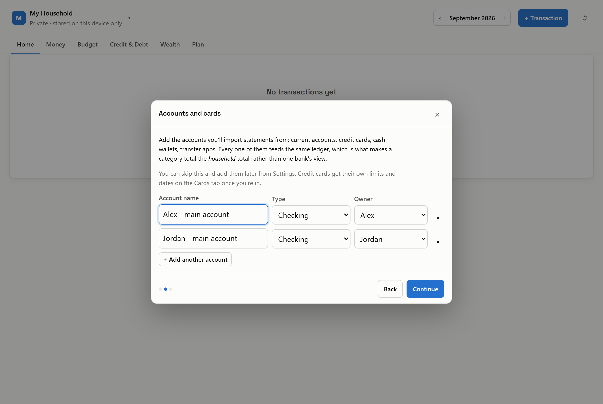

The app suggests one account for each adult. Change the names to match your real
accounts, for example "Chase checking" or "Amex card".

Click **+ Add another account** for each extra one you have: current accounts,
savings, credit cards, cash apps.

Do not worry about getting this perfect. You can change all of it later: click
your household name at the top left, then **Household and people**.

Click **Continue**.

### Step 3 of 3: how to begin

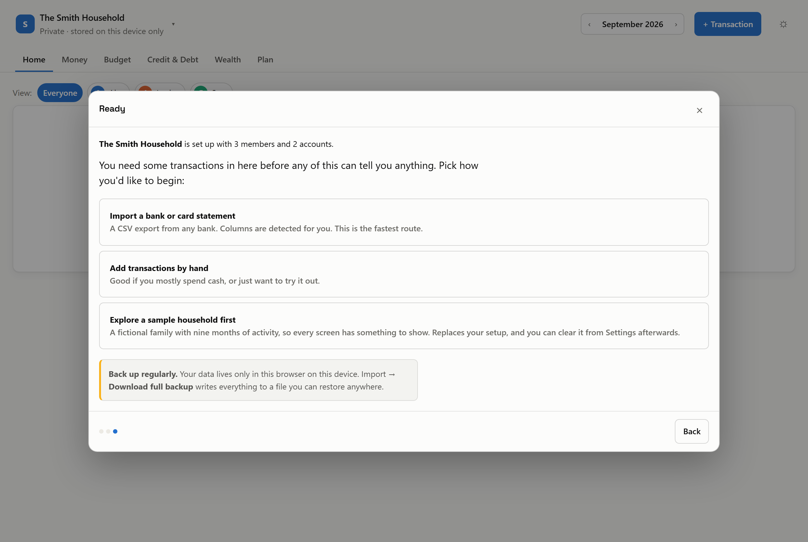

| Option | What happens |
|---|---|
| **Import a bank or card statement** | The best choice. Takes you to the import screen. |
| **Add transactions by hand** | Opens a form to type in one purchase at a time. |
| **Explore a sample household first** | Fills the app with a made-up family so you can look around safely. |

> **New to this?** Choose **Explore a sample household first**. Click through
> every screen to see what it does, using pretend numbers. When you are ready,
> open **Settings** from the household menu and click **Clear all data**. That
> removes the pretend numbers but
> keeps the household members you just entered.

---

## 6. Add your spending

The dashboard **never connects to your bank** and never asks for your banking
password. You download a file from your bank yourself and give that file to the
app.

### Step 1: get the file from your bank

1. Sign in to your bank or credit card website as normal
2. Look for **Download**, **Export**, **Download transactions** or
   **Statements**
3. If you are offered a choice of format, pick **CSV**. If only **PDF** is
   offered, that works too
4. Save the file somewhere you can find it, such as **Downloads**

The app reads three kinds of file:

| File type | How well it works |
|---|---|
| **CSV** (spreadsheet) | Best. Always accurate. Use this when your bank offers it. |
| **PDF** statement | Very good, as long as the PDF has real text in it. |
| **Word** document | Good. Older `.doc` files work less well than `.docx`. |

### Step 2: bring it into the app

Click your household name at the top left, then **Import a statement**. Drag your file
onto the dotted box, or click **Choose a statement file**.

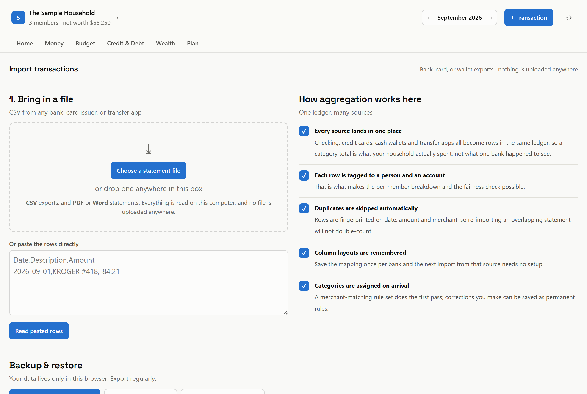

A PDF takes a few seconds to read. Everything happens on your own device and
nothing is uploaded anywhere.

### Step 3: check what it found, then apply

A review screen appears. **Nothing has been saved yet.**

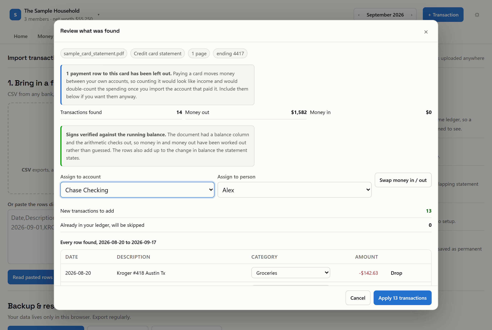

Check these before you continue:

- **The list of rows.** Each shows a date, a description, a category and an
  amount. Change any category using its dropdown. Click **Drop** to remove a row
  you do not want.
- **The coloured message.** Green means the amounts were checked against the
  running balance in your statement and are correct. Amber means the app had to
  work them out from the wording. If money in and money out look reversed, click
  **Swap money in / out**.
- **Which account and which person** the rows belong to. Set both.
- **Card details**, on credit card statements only. If the statement listed a
  credit limit, minimum payment, APR or due date, each appears with a tick box.
  Untick anything you do not want copied across.

Then click the blue **Apply** button.

Repeat for each account. Importing the same file twice is safe, because the app
recognises rows it already has and skips them.

> ### Two things the app does deliberately
>
> **Card payments are left out.** On a credit card statement, a line such as
> "PAYMENT THANK YOU" is you moving your own money onto the card. It is not
> income. Counting it would make your income look bigger than it is. Those rows
> arrive already unticked, with a note. Include them if you disagree.
>
> **Nothing is saved until you press Apply.** The app never changes your figures
> based on a guess.

---

## 7. Back up your data

**Please do not skip this.**

Everything you enter is stored inside your web browser, on that one device.
There is no online account and no copy anywhere else. If you clear your browser
data, or the device is lost, the figures are gone and nobody can recover them
for you.

Backing up takes five seconds.

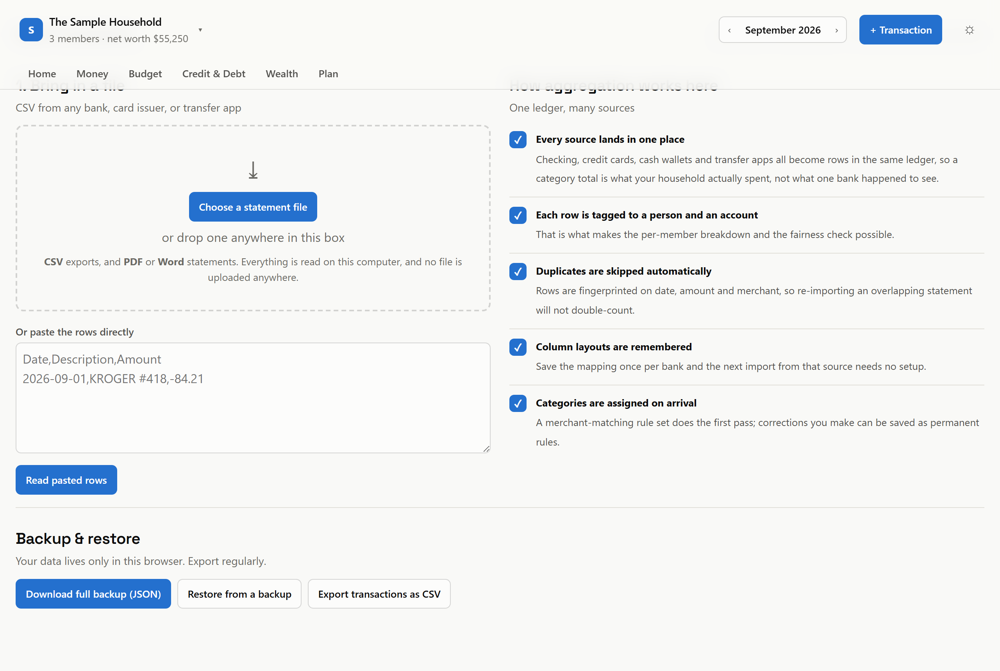

**Step 1.** Click your household name at the top left.

**Step 2.** Click **Download backup**.

**Step 3.** Save the file somewhere safe: OneDrive, Google Drive, iCloud, or a
Documents folder.

Do this once a month. The app reminds you if 30 days go by without one.

### To restore a backup

Click your household name at the top left, then **Import a statement**, then
**Restore backup**, then pick your saved file. Everything returns exactly as it
was.

This is also how you **move to a new device**, or copy your figures from your
computer to your phone. Each device keeps its own separate copy, so they do not
sync automatically.

---

## 8. Have a look around

### Home

Your month in a sentence, then anything that needs attention, then the figures
behind it.

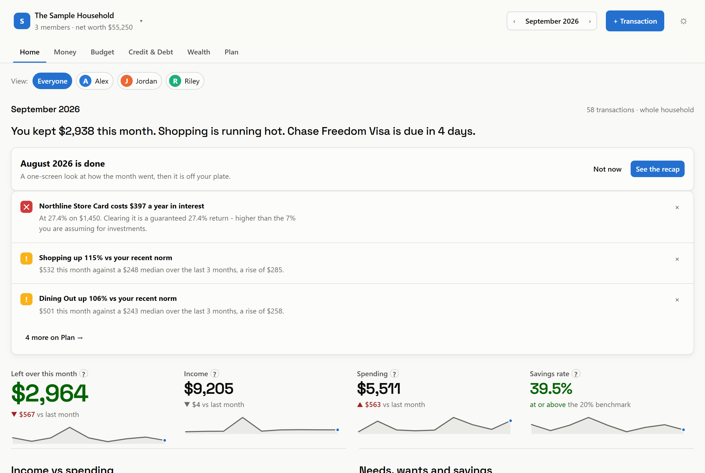

### Credit and debt

Every card's utilisation, when each statement closes, what is due next, and a
scorecard of the things that affect a credit score.

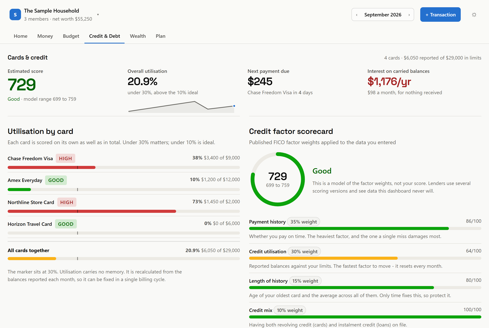

The same screen on a phone, in a single column:

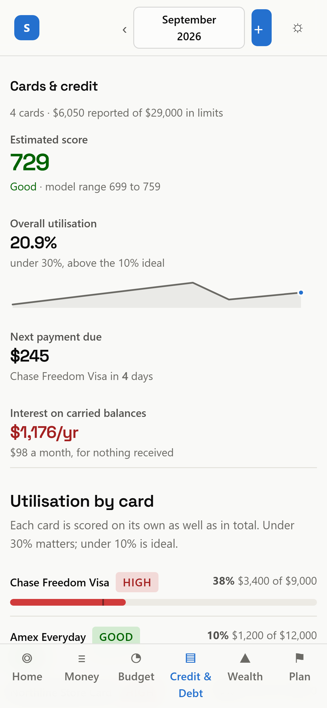

### Plan

A health score, a priority list of what to do next, and long-term projections
built from your own numbers.

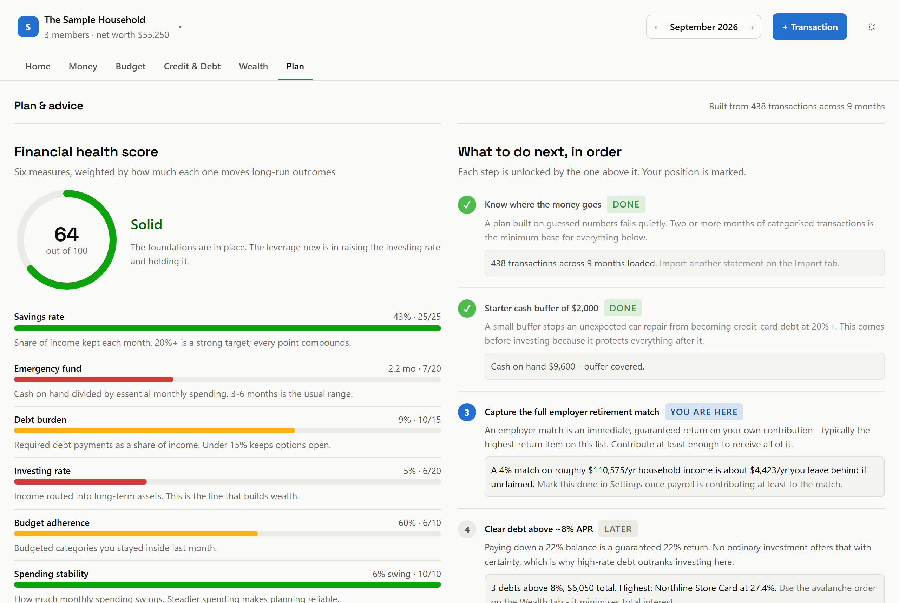

### The six destinations

| Where | What it is for |
|---|---|
| **Home** | The month in a sentence, and anything that needs attention |
| **Money** | Every transaction, searchable. Change a category here |
| **Budget** | Spending limits per category, with a pace marker |
| **Credit & Debt** | Credit cards, utilisation, payment timing and score factors |
| **Wealth** | Net worth, debts, savings goals, debt payoff plans |
| **Plan** | Health score, next steps, projections |

Importing a statement, downloading a backup, and settings all live behind your
household name at the top left.

Use the arrows either side of the month name to move between months. Use the
coloured name buttons to see one person's spending on its own.

Everything saves by itself. There is no Save button and there does not need to
be one.

---

## 9. If something goes wrong

### A red banner says it is not saving my data

Your browser is blocking storage for files opened straight from disk. Ask
whoever sent you the app for a **web link** instead of a file.

### The PDF I imported was not read

Some PDFs are pictures rather than text, usually because the statement was
scanned or photographed. There is no text inside them to extract.

**A quick test:** open the PDF and try to select a line of text with your mouse.
If nothing highlights, it is a picture. Download the statement from your bank
again and choose **CSV**.

Password-protected PDFs also cannot be read. Open the file in your PDF reader,
print it to a new PDF without the password, then import that.

### The charts are empty

The dashboard needs transactions before it can show you anything. Open the
household menu, choose **Import a statement**, and add one. Or load the sample
data from **Settings** to see how it all looks.

### I closed the tab and lost everything

You have not. Open it again and it is all still there.

### The amounts are the wrong way round

On the review screen, click **Swap money in / out** before applying. If you have
already applied them, go to **Settings**, then **Clear all data**, and import
again.

---

## 10. Common questions

**Is my financial information sent anywhere?**
No. There is no server involved and nothing you type ever leaves your device.
You can turn off your internet entirely and the app still works.

**Does it need my bank password?**
No, and it never will. You download a file from your bank yourself.

**Does it cost anything?**
No.

**Can my family each have their own copy?**
Yes. Each copy is completely separate, with its own data. Nobody can see anyone
else's figures.

**Will my phone and my computer show the same figures?**
No. Each device keeps its own copy. To move figures across, download a backup on
one device and restore it on the other, as in [Section 7](#7-back-up-your-data).

**Is it in the App Store or Google Play?**
No. It installs directly from the browser instead, which is why there is nothing
to buy and no account to make.

**Can I trust the advice?**
Treat it as a well-informed calculator, not a financial advisor. It applies
widely published planning rules to the numbers you gave it. It does not know
your tax situation, your job security or your family circumstances, and it never
recommends a specific investment. The credit score it shows is an estimate built
from your own entries, not your real score from a credit bureau. For decisions
that matter, speak to a licensed advisor.
