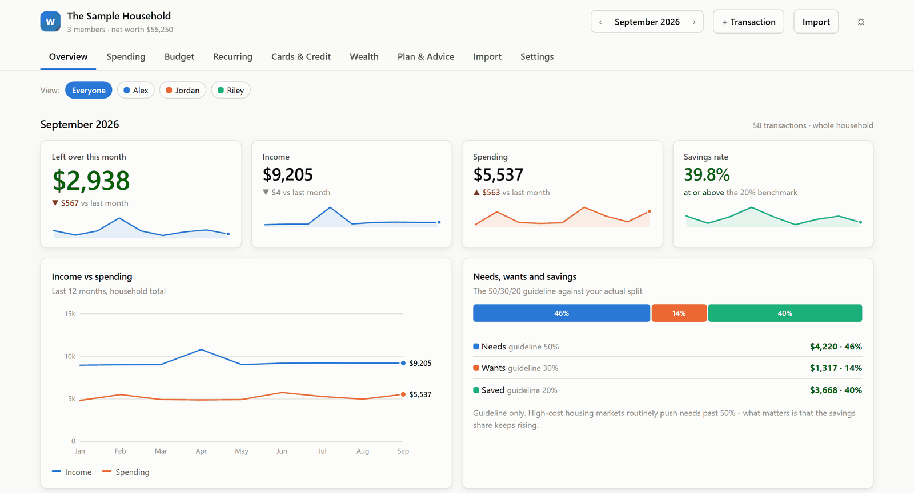
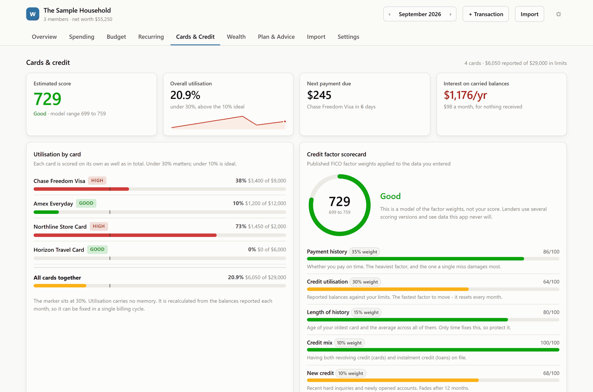
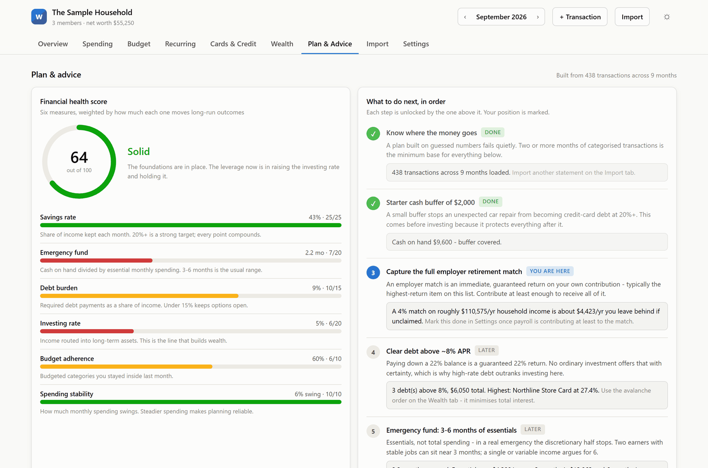
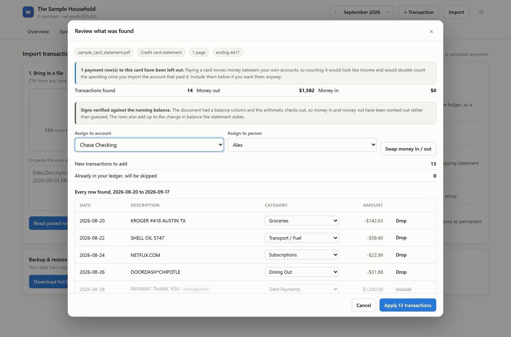
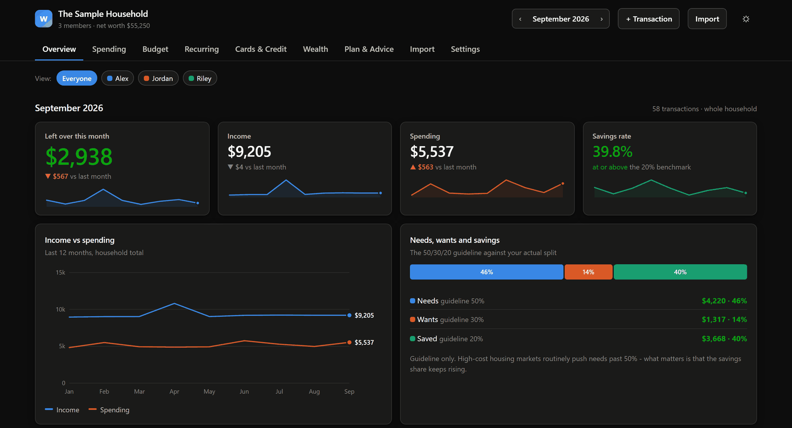
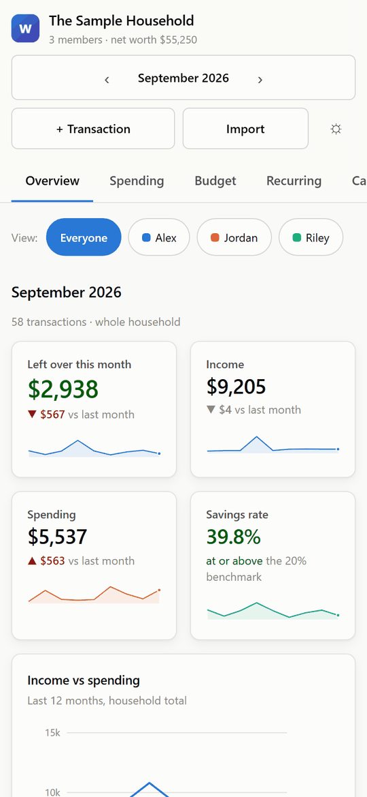
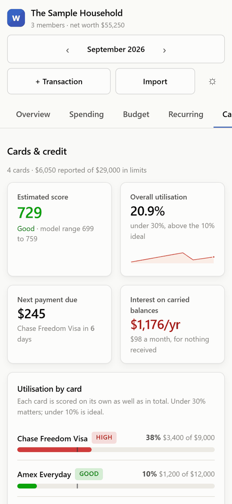

# Household Wealth Dashboard

A private, offline spending tracker and financial planner for your whole household.

### **[Open the dashboard](https://householdfinancemanager.netlify.app/)**

**Your data never leaves your device.** No server, no account, no sign-up, no
fee. Works on Windows, Mac, Android, iPhone and iPad. Add it to your home screen
or Start menu and it keeps working with no internet at all.

---

## Getting started

Open the link above and answer three short questions: who is in your household,
what accounts you have, and how you would like to begin.

Not ready to use your own figures? Choose **Explore a sample household** and
click around a made-up family first.

New to it? The [illustrated installation guide](INSTALL.md) walks through every
step with screenshots.

### Keep it on your device

| Device | How |
|---|---|
| **iPhone, iPad** | Open the link in **Safari**, tap **Share**, then **Add to Home Screen** |
| **Android** | Open the link in Chrome, tap the menu, then **Install app** |
| **Windows, Mac** | Click the install icon in the address bar, or **Settings**, then **Install as an app** |

You can also [download the single file](https://github.com/Hassanolowofela/wealth-dashboard/raw/main/dist/wealth-dashboard.html)
and double-click it. That is the entire app in one file, for computers, with no
internet needed at all.

---

## What it does

### Credit cards, taken seriously

Utilisation per card and in total, when each statement closes as against when
payment is due, a scorecard of the factors that move a credit score, and which
card to use where based on what you actually spend.

The distinction most tools miss: the balance that reaches the credit bureaus is
the one sitting there when the **statement closes**, usually about three weeks
before the payment is due. Paying before that date is what lowers reported
utilisation. Paying by the due date only protects your payment history.

### Advice built from your own numbers

A health score, a prioritised list of what to do next, and long-run projections.
Nothing generic: every figure comes from your ledger.

### Import statements, including PDFs

Drop in a CSV, a PDF or a Word statement. Everything is read on your own machine
and nothing is uploaded.

Where a statement carries a running balance, money in and money out are
**verified arithmetically** rather than guessed. Card fields such as the credit
limit, minimum payment and APR are read from the statement and offered as
tick-box updates. Nothing is saved until you press Apply.

### Light and dark

Follows your system setting, or switch it yourself.

### On a phone

Controls grow to a comfortable size, dialogs fill the screen, and the layout
becomes a single column.

  
  

---

## Every tab

| Tab | What it is for |
|---|---|
| **Overview** | This month at a glance |
| **Spending** | Every transaction, searchable |
| **Budget** | Are you on pace this month? |
| **Recurring** | Subscriptions and bills, ranked by yearly cost |
| **Cards & Credit** | Utilisation, payment timing, credit factors, rewards routing |
| **Wealth** | Net worth, goals, and a debt-payoff planner |
| **Plan & Advice** | Your health score and prioritised next steps |
| **Import** | Bring data in, take backups out |
| **Settings** | People, accounts, and the assumptions behind the maths |

---

## Back up your data

Your figures live in one browser on one device. There is no online account, so
nobody can recover them for you.

Go to **Import**, then **Download backup**, once a month, and keep the file
somewhere safe. The app reminds you if 30 days pass without one.

---

## Privacy and security

No server, no account, no telemetry, and zero third-party code. The only network
request the app makes is its offline cache fetching its own files.

It is served from its own subdomain, so its stored data is isolated from every
other site. [SECURITY.md](SECURITY.md) sets out the full picture, including what
was tested and the limits that remain.

## A note on advice

The Plan tab applies widely published personal-finance guidelines to your
figures. It does not know your tax situation or your full circumstances, and it
never recommends a specific investment. The credit score it shows is an estimate
built from your own entries, not your real score from a credit bureau. For
decisions that matter, talk to a licensed financial advisor.

---

Want the details? [DOCS.md](DOCS.md) covers how the numbers are calculated, the
file layout, and how to customise categories and rules.
